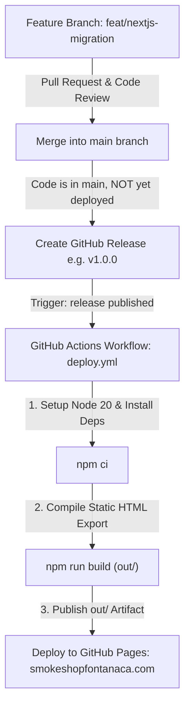

# 🚀 Next.js + TypeScript Migration & Learning Plan

Welcome to the finalized migration blueprint for **A1 Smoke Shop**! This document outlines a safe, phased approach to transitioning the current website into a modern, production-grade **Next.js (App Router) + TypeScript** application, deployed via **GitHub Releases** to **GitHub Pages**.

---

## 🎯 1. Goals & Learning Objectives

1. **🛡️ 100% Production Safety**: All development work is performed strictly on the isolated branch **`feat/nextjs-migration`**. The `main` branch remains untouched during development.
2. **🏷️ Release-Driven Deployment Control**: Merging to `main` will **NOT** automatically deploy to the live website. Deployments trigger **only when you publish an official GitHub Release** (e.g., `v1.0.0`).
3. **🧠 Hands-On Learning**: Learn modern web engineering principles:
   - **Next.js App Router**: How file-system routing works (`app/layout.tsx`, `app/page.tsx`).
   - **Server vs. Client Components**: Using `'use client'` for interactive elements (theme toggles, modal dialogs, search filter pills, countdown badges).
   - **TypeScript Type Safety**: Defining clean interfaces for inventory, reviews, store schedule, and FAQs.
   - **Lucide React Icons**: Modern, tree-shakeable SVG icon integration.
   - **Static HTML Export**: Configuring `output: 'export'` with `trailingSlash: true` for zero-cost GitHub Pages hosting.
4. **📈 Future-Proof Multi-Page Scalability**: Seamlessly scale from a single landing page to dedicated subpages (`/about/`, `/products/`, `/faq/`, `/contact/`) without broken links or routing issues on GitHub Pages.

---

## 🛠️ 2. Confirmed Tech Stack & Release Strategy

| Component | Choice | Rationale |
|---|---|---|
| **Framework** | Next.js 15+ (App Router) | Modern industry standard, fast static export, built-in SEO metadata |
| **Language** | TypeScript | Type safety, autocomplete, self-documenting data structures |
| **Styling** | Tailwind CSS | Utility-first, responsive design, dark/light theme support |
| **Icons** | **Lucide React** (`lucide-react`) | Lightweight, tree-shakeable, modern SVG icon library |
| **Deployment Trigger** | **GitHub Release (`published`)** | Safe, manual control over when production changes go live |
| **Hosting** | GitHub Pages (`smokeshopfontanaca.com`) | Static hosting with custom domain and automated CI/CD via GitHub Actions |
| **Runtime** | Node.js 20+ LTS | Long-term support, stable build environment |
| **Branch** | `feat/nextjs-migration` | Complete isolation from production |

---

## ⚠️ 3. Critical Gotchas & Pre-Flight Checklist

> [!IMPORTANT]
> These 6 items must be properly configured to ensure flawless static deployment on GitHub Pages without domain downtime or broken styling:

1. **🛑 The `_next` Folder & `.nojekyll`**:
   - Next.js exports assets into `_next/static/`. By default, GitHub Pages uses Jekyll, which **blocks folders starting with an underscore**.
   - **Requirement**: Place an empty `public/.nojekyll` file in the project.
2. **🌐 Custom Domain & `CNAME` Preservation**:
   - To keep `smokeshopfontanaca.com` active, the `CNAME` file must reside in `public/CNAME` so it gets automatically copied to `out/CNAME` during every build.
3. **🖼️ Next.js Static Images (`next/image`)**:
   - Because GitHub Pages has no server-side Node.js image optimization runtime, `next.config.ts` must include `images: { unoptimized: true }`.
4. **⚙️ GitHub Pages Source Setting**:
   - In your GitHub Repository settings (**Settings → Pages → Build and deployment → Source**), switch from **"Deploy from a branch"** to **"GitHub Actions"**.
5. **🔍 SEO Files (`robots.txt` & `sitemap.ts`)**:
   - Add `public/robots.txt` and `src/app/sitemap.ts` to maximize Google Local Search crawling.
6. **📊 Analytics & Webmaster Tools (Optional)**:
   - Google Analytics (GA4) or Google Search Console verification meta tags can be added directly in `app/layout.tsx`.

---

## 🏗️ 4. Deployment Workflow: Release-Driven Pipeline



---

## 📁 5. Target Directory Structure

```text
a1-smoke-shop/
├── .github/
│   └── workflows/
│       └── deploy.yml              # CI/CD: Triggered ONLY on published GitHub Releases
├── public/
│   ├── .nojekyll                   # Bypasses Jekyll to allow _next/ folder loading
│   ├── CNAME                       # smokeshopfontanaca.com
│   ├── robots.txt                  # Instructs search engine crawlers
│   ├── favicon.ico                 # Favicon icon
│   └── images/                     # Optimized store photos and assets
├── src/
│   ├── app/
│   │   ├── layout.tsx              # Root HTML, SEO Metadata, Google Fonts, Theme Provider
│   │   ├── page.tsx                # Main single-page landing layout
│   │   ├── sitemap.ts              # Dynamic sitemap generator for Google Search
│   │   ├── globals.css             # Tailwind base & custom glassmorphism utilities
│   │   ├── about/                  # [Future Multi-Page] /about/
│   │   │   └── page.tsx
│   │   ├── products/               # [Future Multi-Page] /products/
│   │   │   └── page.tsx
│   │   └── faq/                    # [Future Multi-Page] /faq/
│   │       └── page.tsx
│   ├── components/
│   │   ├── layout/
│   │   │   ├── Header.tsx          # Navigation bar with Lucide icons & theme toggle
│   │   │   ├── Footer.tsx          # Legal warnings, copyright, quick links
│   │   │   └── MobileBottomBar.tsx # Sticky bottom CTA bar (Call / Directions / SMS)
│   │   ├── sections/
│   │   │   ├── Hero.tsx            # Hero with Open/Closed badge & main CTAs
│   │   │   ├── About.tsx           # Jay's story & value propositions
│   │   │   ├── ProductCatalog.tsx  # Filterable product grid with Lucide icons & search
│   │   │   ├── Reviews.tsx         # Google Reviews grid with direct review button
│   │   │   ├── LocationHours.tsx   # Weekly hours schedule & Google Map
│   │   │   └── FAQSection.tsx      # Accordion FAQs with Schema markup
│   │   └── ui/
│   │       ├── AgeGateModal.tsx    # 21+ verification popup (FOUC-safe)
│   │       ├── LiveStatusBadge.tsx # Real-time "Open Now / Closed" indicator
│   │       └── Lightbox.tsx        # Store photo gallery viewer
│   ├── data/
│   │   ├── products.ts             # Typed product & brand catalog data
│   │   ├── reviews.ts              # Customer reviews data
│   │   ├── storeHours.ts           # Weekly schedule & calculation helpers
│   │   └── faqs.ts                 # Frequently Asked Questions data
│   ├── types/
│   │   └── index.ts                # TypeScript interfaces (Product, Review, FAQ, Hours)
│   └── lib/
│       ├── utils.ts                # Helper functions (class merging)
│       └── timeUtils.ts            # Pacific Time open/closed status calculator
├── next.config.ts                  # Next.js configuration (output: 'export', trailingSlash: true)
├── tailwind.config.ts              # Tailwind theme, colors, and font configuration
├── tsconfig.json                   # TypeScript compiler options
└── package.json                    # Dependencies (lucide-react, next, react, etc.)
```

---

## 🗺️ 6. Phased Implementation Roadmap

### 📍 Phase 1: Environment & Branch Setup
* Switch to dedicated branch: `feat/nextjs-migration`.
* Verify/install **Node.js LTS (v20+)** and **npm**.
* Scaffold Next.js with TypeScript and Tailwind CSS.
* Install **`lucide-react`**.
* Configure `next.config.ts`:
  ```ts
  import type { NextConfig } from 'next';

  const nextConfig: NextConfig = {
    output: 'export',              // Generates static HTML in out/ for GitHub Pages
    images: { unoptimized: true },     // Static hosting compatibility
    trailingSlash: true,           // Ensures /about/ generates /about/index.html
  };

  export default nextConfig;
  ```

---

### 📍 Phase 2: TypeScript Data Models & Mock Data
* Define strict TypeScript interfaces in [`src/types/index.ts`](file:///D:/Abhishek/Website/a1-smoke-shop/src/types/index.ts) for:
  - `ProductItem` (ID, title, description, category, icon, brand tags)
  - `CustomerReview` (ID, author, role, rating, content, date)
  - `StoreHours` (day, openTime, closeTime, isClosed)
  - `FAQItem` (question, answer, category)
* Populate data files in `src/data/` for clean modular code.

---

### 📍 Phase 3: Component Conversion & Lucide Icons
Convert each HTML section into a typed React component:
1. **`Header.tsx` & `ThemeToggle.tsx`**: Dark/Light mode state with Lucide `Sun` / `Moon` / `Menu` / `Phone` icons.
2. **`Hero.tsx` & `LiveStatusBadge.tsx`**: Dynamic Pacific Time calculation (Open / Closing Soon / Closed).
3. **`AgeGateModal.tsx`**: Safe client-side 21+ verification with `sessionStorage`.
4. **`ProductCatalog.tsx`**: Category filter tabs and live search bar.
5. **`Reviews.tsx`**: Google Reviews cards + direct Google review submission link.
6. **`LocationHours.tsx`**: Weekly hours table + interactive responsive Google Map iframe.
7. **`FAQSection.tsx`**: Expandable accordion with Lucide `ChevronDown` icons.
8. **`MobileBottomBar.tsx`**: Sticky bottom mobile bar with Call, SMS, and Directions buttons.

---

### 📍 Phase 4: SEO, Metadata & Schema.org Structured Data
* Configure Next.js App Router `Metadata` API in `app/layout.tsx`:
  - Canonical URL (`https://smokeshopfontanaca.com/`)
  - Open Graph (`og:*`) and Twitter Cards
* Inject Schema.org JSON-LD scripts:
  - `LocalBusiness` / `Store` Schema
  - `FAQPage` Schema
* Configure `public/robots.txt` and `src/app/sitemap.ts`.

---

### 📍 Phase 5: GitHub Actions CI/CD for Release-Based Deployment
* Configure `.github/workflows/deploy.yml` triggered **strictly on published releases**:
  ```yaml
  name: Deploy to GitHub Pages

  on:
    release:
      types: [published]
    workflow_dispatch: # Allows manual trigger from GitHub Actions tab if needed

  permissions:
    contents: read
    pages: write
    id-token: write

  concurrency:
    group: 'pages'
    cancel-in-progress: false

  jobs:
    deploy:
      environment:
        name: github-pages
        url: ${{ steps.deployment.outputs.page_url }}
      runs-on: ubuntu-latest
      steps:
        - name: Checkout
          uses: actions/checkout@v4
        - name: Setup Node
          uses: actions/setup-node@v4
          with:
            node-version: 20
            cache: npm
        - name: Install dependencies
          run: npm ci
        - name: Build Next.js Static Export
          run: npm run build
        - name: Setup Pages
          uses: actions/configure-pages@v5
        - name: Upload artifact
          uses: actions/upload-pages-artifact@v3
          with:
            path: ./out
        - name: Deploy to GitHub Pages
          id: deployment
          uses: actions/deploy-pages@v4
  ```
* Include `public/.nojekyll` and `public/CNAME` in the build.

---

### 📍 Phase 6: Testing, QA & Creating Initial Release
* Local production build validation (`npm run build`).
* Cross-device and dark/light theme checks.
* Pull Request merged to `main`.
* Create GitHub Release `v1.0.0` to trigger the first official Next.js deployment.
